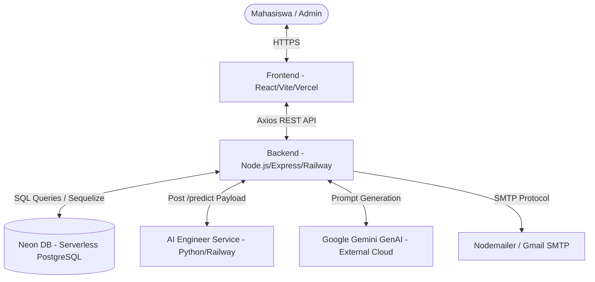

# BURNIVA - FULL PROJECT TECHNICAL DOCUMENTATION

**Sistem Monitoring Burnout & Mental Health berbasis Web dengan Integrasi AI Prediction dan Generative AI Recommendation**

---

## 1. INFORMASI PROJECT

**Nama Project:** Burniva  
**Jenis Sistem:** Platform Monitoring Burnout & Mental Health berbasis Web dengan Integrasi AI Prediction dan Generative AI Recommendation.  

**Tujuan Sistem:**  
Burniva merupakan platform berbasis web yang dirancang untuk membantu mahasiswa memantau kondisi kesehatan mental, mendeteksi potensi burnout sejak dini, melakukan analisis kondisi psikologis berdasarkan *assessment* (penilaian) harian, serta memberikan rekomendasi tindakan personalisasi yang didukung oleh integrasi Kecerdasan Buatan (AI).

**Fokus Utama Sistem:**

* **Burnout Detection:** Mendeteksi tingkat risiko burnout (Rendah, Sedang, Tinggi) berdasarkan algoritma AI.
* **Mental Health Monitoring:** Memantau kondisi emosional, kecemasan, dan stres mahasiswa secara berkala.
* **Personalized Recommendation:** Memberikan saran praktis dan tindak lanjut *to-do list* yang dipersonalisasi.
* **Student Mental Wellness:** Berfokus pada kesejahteraan mental di lingkungan akademik/perkuliahan.
* **Early Burnout Prevention:** Pencegahan dini sebelum kondisi burnout mencapai tahap kritis.
* **Daily Monitoring System:** Sistem pencatatan harian yang membentuk tren dan histori.

---

## 2. DEPLOYMENT INFORMATION

Sistem Burniva mengadopsi arsitektur *cloud-native* dengan pemisahan layanan untuk memastikan skalabilitas dan reliabilitas.

* **Frontend Deployment:** Vercel
  * **Frontend URL:** [https://burniva-capstone.vercel.app](https://burniva-capstone.vercel.app)
* **Backend Deployment:** Railway
  * **Backend URL:** [https://burniva-capstone-production.up.railway.app](https://burniva-capstone-production.up.railway.app)
* **AI Engineer API (Custom Prediction):** Railway
  * **AI Prediction URL:** [https://capstonee.up.railway.app](https://capstonee.up.railway.app)
* **Database:** Neon PostgreSQL
  * **Database Provider:** Neon DB (PostgreSQL Serverless Cloud)

---

## 3. SYSTEM ROLE

Sistem Burniva mengimplementasikan rancangan *Role-Based Access Control* (RBAC) yang membagi pengguna ke dalam dua peran (role) utama, yaitu **User** dan **Admin**.

### 3.1. USER (Mahasiswa)

Role ini adalah target pengguna utama aplikasi yang melakukan *self-assessment* dan memantau kondisi mereka.

* **Hak Akses & Fitur:**
  * Melakukan pendaftaran akun (Register) dan Login.
  * Mengakses halaman *Dashboard* personal untuk melihat ringkasan kondisi terkini dan tren *burnout*.
  * Mengisi form *Assessment* (Input) harian yang mencakup aspek mental, akademik, dan gaya hidup.
  * Melihat *Result* (Hasil Analisis) yang dihasilkan oleh AI.
  * Mengelola *To-Do List* harian yang dihasilkan secara otomatis oleh *Generative AI* atau ditambahkan manual.
  * Melihat *History* (Riwayat) seluruh pengisian assessment.
  * Mengubah data *Profile* dan *Password*.
* **Route Protection:** Seluruh rute internal pengguna dilindungi oleh `ProtectedRoute.jsx` di frontend dan `authMiddleware.js` di backend. Jika token JWT tidak ada atau tidak valid, pengguna tidak dapat mengakses halaman dashboard dan akan diarahkan ke halaman login.

### 3.2. ADMIN (Administrator Sistem)

Role ini bertanggung jawab atas pemantauan ekosistem platform, manajemen pengguna, dan analisis data agregat.

* **Hak Akses & Fitur:**
  * Mengakses halaman *Dashboard Admin* yang menampilkan *Stats Cards*, *Analytics Charts*, dan *Recent Activities*.
  * Manajemen pengguna melalui halaman *Pengguna Admin* (melihat daftar, mencari, filter, *suspend/unsuspend*, dan menghapus akun beserta data terkaitnya/ *cascade*).
  * Memantau kondisi pengguna secara keseluruhan melalui *Monitoring Admin* dan mengunduh laporan (CSV/Excel).
  * Melihat analitik mendalam di halaman *Analitik Admin* (Distribusi Burnout, Tren, Pertumbuhan Pengguna, Korelasi Tidur, Distribusi Semester).
  * Mengelola profil admin.
* **Route Protection:** Rute admin di frontend dilindungi oleh `AdminRoute.jsx` (memeriksa keberadaan token dan string role `"admin"`). Di backend, dilindungi oleh *chaining middleware* `authMiddleware` dan `adminMiddleware`.

### 3.3. Redirect System & Route Guard (Frontend)

Frontend menggunakan React Router DOM dengan tiga lapis penjagaan (*Route Guards*):

1. **PublicRoute:** Mencegah pengguna yang sudah *login* untuk mengakses halaman otentikasi (Login/Register/Forgot Password). Jika *user* sudah *login*, mereka otomatis di-redirect ke `/dashboard` atau `/admin/dashboard` sesuai *role*.
2. **ProtectedRoute:** Memastikan halaman pengguna hanya dapat diakses dengan token aktif. Jika gagal, redirect ke `/login`.
3. **AdminRoute:** Memastikan pengguna dengan akses memiliki otorisasi ganda (Token valid & Role `admin`). Jika role bukan admin, redirect ke `/dashboard`.

---

## 4. AUTHENTICATION SYSTEM

Burniva menggunakan sistem autentikasi berbasis *JSON Web Token* (JWT) yang menjamin keamanan sesi tanpa *state* di sisi server (stateless).

### 4.1. Alur Autentikasi Utama

* **Login System:** Pengguna mengirimkan *email* dan *password*. Backend mencari pengguna di tabel `users`. Jika akun ditemukan, sistem mengecek field `is_suspended` (jika `true`, login ditolak). Jika aman, password dicocokkan menggunakan fungsi *compare* dari `bcryptjs`. Jika cocok, JWT di-generate menggunakan `jsonwebtoken` dengan payload `id`, `email`, dan `role`, lalu dikirimkan ke *client* bersama data profil.
* **Register System:** Pengguna mendaftarkan diri dengan nama, email, password, dan konfirmasi password. Backend memvalidasi ketersediaan email. Password di-hash dengan `bcryptjs` (salt rounds = 10) sebelum disimpan ke *database*. Role *default* adalah `"user"`.
* **Token Mechanism:** Token disimpan di `localStorage` (*client-side*) oleh *state manager* (Zustand: `useAuthStore`). Token ini disematkan otomatis ke *Header Authorization* (`Bearer <token>`) pada setiap *request* melalui Axios interceptor (`src/services/api.js`).
* **Authorization (Backend):** `authMiddleware.js` akan memotong *header Authorization*, mengekstrak token, dan memverifikasinya menggunakan `JWT_SECRET`. Jika valid, payload akan di-decode dan disisipkan ke objek request (`req.user = decoded`), memungkinkan *controller* selanjutnya mengenali identitas *requester*.
* **Session Handling:** Sesi sepenuhnya bergantung pada *lifecycle* token JWT. Jika Axios interceptor mendeteksi *response status* `401 Unauthorized` dari backend (token kadaluarsa/tidak valid), Zustand akan menghapus token dan *local data*, lalu memaksa pengguna kembali ke `/login`.

### 4.2. Forgot Password System

Fitur pemulihan kata sandi dibangun secara *native* di dalam ekosistem Burniva.

**Arsitektur dan Flow Lengkap:**

1. **Request Reset (Frontend):** Pengguna menavigasi ke rute `/forgot-password` dan memasukkan *email* terdaftar.
2. **Generate Token (Backend):** `authController.forgotPassword` mencari pengguna berdasarkan email. Jika ada, backend men-generate token unik sebesar 32 byte menggunakan modul bawaan Node.js `crypto` (`crypto.randomBytes(32).toString("hex")`).
3. **Simpan Token:** Token tersebut dan waktu kadaluarsanya (1 jam dari waktu *generate*) disimpan sementara ke *database* pada kolom `reset_token` dan `reset_token_expire` milik pengguna tersebut.
4. **Kirim Email (Nodemailer):** `emailService.js` dipanggil. Nodemailer (dengan *transport* Gmail SMTP) akan merender template HTML berisi tautan reset dinamis (`CLIENT_URL/reset-password/TOKEN`) dan mengirimkannya ke kotak masuk pengguna.
5. **User Klik Tautan:** Pengguna mengklik tautan di email dan diarahkan ke frontend di rute `/reset-password/:token`.
6. **Input Password Baru:** Pengguna mengisi formulir sandi baru dan konfirmasi sandi.
7. **Token Validation & Update (Backend):** `authController.resetPassword` menerima token dari URL Parameter dan mencari *user* di mana `reset_token` cocok dan `reset_token_expire` lebih besar dari waktu saat ini (`[Op.gt]: new Date()`).
8. **Password Update:** Jika valid, password baru di-hash (bcrypt), lalu disimpan menimpa password lama. Kolom `reset_token` dan `reset_token_expire` dikosongkan (diatur ke `null`) untuk mengamankan re-use token.
9. **Login Kembali:** Proses selesai, pengguna dapat *login* dengan kata sandi baru.

---

## 5. TECH STACK

Burniva dibangun di atas fondasi teknologi *modern web development* yang berfokus pada kecepatan, keamanan, dan *maintainability*. Seluruh basis kode dibagi atas tiga pilar utama berdasarkan bahasa pemrograman:
* **JavaScript/JSX:** Sebagai bahasa utama untuk seluruh rekayasa logika Frontend (React) dan Backend (Node.js).
* **Python:** Sebagai bahasa komputasi matematis untuk arsitektur Machine Learning (AI Prediction).
* **SQL (Dialek PostgreSQL):** Sebagai struktur definisi relasional data, diabstraksi melalui Sequelize ORM.

### 5.1. Frontend Tech Stack

* **Bahasa Pemrograman Utama:** JavaScript (ES6+), JSX, HTML5, CSS3
  * *Alasan:* JavaScript merupakan bahasa pemrograman native web modern. JSX mempermudah deklarasi UI berbasis JavaScript secara fungsional.
* **Framework:** React.js (v19)
  * *Alasan:* Berbasis komponen, reaktif, dan memiliki ekosistem yang matang untuk membangun antarmuka pengguna interaktif.
* **Build System:** Vite
  * *Alasan:* Jauh lebih cepat dari Webpack, *Hot Module Replacement* (HMR) seketika, dan optimasi *bundling* produksi yang sangat efisien.
* **Styling:** Tailwind CSS (v4)
  * *Alasan:* *Utility-first* CSS framework yang mempercepat pembuatan UI kustom tanpa meninggalkan file JSX. Proyek ini mendefinisikan sistem warna khusus (Deep Teal, Sage Gray, Metallic Gold) dalam `tailwind.config.js` untuk identitas Burniva.
* **State Management:** Zustand
  * *Alasan:* Sangat ringan, minim *boilerplate* dibandingkan Redux. Di Burniva, Zustand dipakai di `useAuthStore.js`, `useBurnoutStore.js`, dan `useTodoStore.js` untuk berbagi *state* dan persistensi ke `localStorage`.
* **Routing:** React Router DOM (v7)
  * *Alasan:* *Industry standard* untuk navigasi *Single Page Application* (SPA) dengan dukungan sistem Layouting bersarang (*Nested Routes*) dan proteksi route (*guards*).
* **API Communication:** Axios
  * *Alasan:* *Promise-based HTTP client* yang handal. Di Burniva, ini diatur tersentralisasi pada `api.js` dengan fungsi *interceptor* untuk injeksi otomatis *Header Authorization* dan *error handling* 401.
* **Icons & Animation:** Lucide React & Framer Motion
  * *Alasan:* Lucide untuk grafis SVG ringan dan konsisten. Framer Motion digunakan untuk transisi halus antar halaman dan *micro-animations* pada UI.
* **Data Visualization:** Recharts
  * *Alasan:* *Library chart* berbasis React komponen yang fleksibel. Digunakan sangat intensif di *Dashboard Admin* (Tren Burnout, Distribusi, Pertumbuhan Pengguna).

### 5.2. Backend Tech Stack

* **Bahasa Pemrograman Utama:** JavaScript (Node.js Runtime)
  * *Alasan:* Memungkinkan pendekatan *Fullstack JavaScript*, sehingga developer dapat membagi logika dan *model data* secara homogen antara sisi klien dan server tanpa kendala translasi bahasa.
* **Runtime:** Node.js
  * *Alasan:* Eksekusi JavaScript di sisi server yang asinkron, non-blocking, ideal untuk operasi I/O API berkecepatan tinggi.
* **Framework:** Express.js (v5)
  * *Alasan:* *Minimalist web framework* standar industri yang mudah untuk men-setup *routing* dan arsitektur *middleware*.
* **Database & ORM:** PostgreSQL & Sequelize (v6)
  * *Alasan:* PostgreSQL (via Neon DB) menawarkan keandalan basis data relasional kelas *enterprise*. Sequelize ORM menjembatani interaksi objek JavaScript ke struktur tabel relasional secara aman, menghilangkan kebutuhan menulis raw SQL secara manual dan melindungi sistem dari serangan SQL Injection.
* **Authentication & Encryption:** jsonwebtoken (JWT) & bcryptjs
  * *Alasan:* Keamanan kriptografi standar industri untuk sesi tanpa *state* dan perlindungan kata sandi yang tidak dapat di-*reverse*.
* **Email Service:** Nodemailer
  * *Alasan:* Library handal untuk mengirimkan email SMTP (*Forgot Password* flow).
* **External Integrations:** `@google/generative-ai` & `axios`
  * *Alasan:* SDK Google untuk Gemini AI dan Axios (Backend) untuk melakukan *request* ke servis AI Engineer secara asinkron.
* **Utility:** `xlsx`
  * *Alasan:* Menghasilkan *export* dokumen Excel (.xlsx) murni untuk kebutuhan laporan *Monitoring Admin*.

---

## 6. DATABASE ARCHITECTURE

Proyek Burniva berjalan pada relasional database PostgreSQL di infrastruktur **Neon DB**. Seluruh manajemen skema diatur secara deklaratif melalui *Sequelize ORM* (berada di `backend/src/models`).

### 6.1. Skema Relasi Antar Tabel

* **1 to N (User to DailyInput):** Seorang pengguna memiliki banyak data input harian.
* **1 to 1 (DailyInput to Prediction):** Setiap satu input harian *assessment* akan memicu satu pembuatan record prediksi AI.
* **1 to N (User to Todo):** Seorang pengguna memiliki banyak daftar Todo.

### 6.2. Rincian Tabel

#### 1. Tabel `users`

* **Tujuan:** Menyimpan data pengguna, kredensial, dan otorisasi role.
* **Kolom & Tipe Data:**
  * `id` (UUID, Primary Key)
  * `name`, `email` (STRING, unique)
  * `password` (STRING, disamarkan/hashed)
  * `gender`, `university`, `major` (STRING)
  * `age`, `semester` (INTEGER)
  * `profile_image` (TEXT)
  * `role` (STRING, default: "user")
  * `is_suspended` (BOOLEAN, default: false) - Digunakan admin untuk membekukan akun.
  * `reset_token`, `reset_token_expire` - Digunakan untuk fitur lupa kata sandi.
  * `createdAt`, `updatedAt` (DATE)

#### 2. Tabel `daily_inputs`

* **Tujuan:** Menyimpan seluruh data parameter harian (*mental*, *akademik*, *lifestyle*) hasil *assessment* pengguna beserta ringkasan hasilnya.
* **Kolom & Tipe Data:**
  * `id` (UUID, Primary Key)
  * `user_id` (UUID, Foreign Key ke `users`)
  * *Kondisi Mental:* `stress`, `anxiety`, `emotional_pressure` (INTEGER)
  * *Kondisi Akademik:* `academic_pressure` (INTEGER), `study_hours` (FLOAT)
  * *Gaya Hidup:* `sleep_hours`, `activity_hours` (FLOAT), `financial_pressure`, `family_expectation`, `social_support` (INTEGER)
  * *Hasil Agregat:* `burnout_score` (INTEGER), `burnout_level` (STRING), `recommendation` (JSON)
  * `createdAt`, `updatedAt` (DATE)

#### 3. Tabel `predictions`

* **Tujuan:** Menyimpan rekaman arsip teknis dari respon spesifik sistem *AI Engineer* dan kalkulasi *mental health index*. Digunakan juga sebagai ekstensi relasional untuk histori detail.
* **Kolom & Tipe Data:**
  * `id` (UUID, Primary Key)
  * `daily_input_id` (UUID, Foreign Key ke `daily_inputs`)
  * `user_id` (UUID, referensi opsional)
  * `risk_level` (ENUM: Rendah, Sedang, Tinggi)
  * `burnout_score`, `mental_health_index` (FLOAT)
  * `burnout_prediction`, `mental_health_prediction` (STRING) - Hasil langsung dari AI Engineer.
  * `analysis_text`, `recommendation` (TEXT)
  * `raw_assessment_input` (JSONB) - Menyimpan parameter asli yang dikirim ke AI untuk audit jejak.

#### 4. Tabel `todos`

* **Tujuan:** Menyimpan daftar tugas harian milik *user*, baik yang dihasilkan manual maupun ter-generate oleh Gemini AI berdasarkan rekomendasi.
* **Kolom & Tipe Data:**
  * `id` (UUID, Primary Key)
  * `user_id` (UUID, Foreign Key ke `users`)
  * `title` (STRING)
  * `description` (TEXT)
  * `priority` (STRING, default: 'medium')
  * `status` (STRING, default: 'pending') - Penanda selesai/belum.
  * `generated_by_ai` (BOOLEAN, default: true) - Penanda pembeda tugas *custom* vs *AI-generated*.
  * `source_prediction_id` (UUID) - Relasi ke tabel prediksi (opsional).

---

## 7. FRONTEND ARCHITECTURE

Frontend Burniva dirancang dengan pendekatan modular berbasis *Reusable Components* (komponen yang dapat digunakan kembali) menggunakan struktur direktori berskala *enterprise*.

### 7.1. Struktur Direktori Utama (`frontend/src/`)

* `/assets`: Asset statis (gambar, logo).
* `/components`: Pecahan UI yang dirancang terpisah.
  * `/admin`: *Sub-components* khusus area administrasi (analitik chart, pengguna tabel, dll).
  * `/common`: UI pendukung global (Loading, Empty, Logo).
  * `/form`: Potongan langkah *Wizard Assessment* (MentalStep, AcademicStep).
  * `/layout`: Struktur pembungkus laman utama (Sidebar, Topbar, Navbar, BottomNav, MainLayout, AdminLayout).
  * `/ui`: *Base building block* UI System Tailwind (Button, Card, Input, Slider, Checkbox).
* `/hooks`: *Custom React Hooks* (`useFetch`, `useForm`).
* `/pages`: *View containers* yang menyatukan seluruh layout dan komponen per-rute.
* `/routes`: Konfigurasi navigasi dan pelindung route (`AppRoutes`, `ProtectedRoute`, `AdminRoute`).
* `/services`: Konfigurasi Axios dan pemanggilan API *backend*.
* `/store`: *State Management* Zustand.
* `/utils`: Fungsi pembantu global (format tanggal, konstanta warna).

### 7.2. Fungsionalitas Halaman (Pages)

#### *Area Publik*

* **Landing Page:** Halaman depan pemasaran fitur Burniva (Hero, Features, How it works).
* **Login & Register:** Antarmuka otentikasi masuk dan daftar akun baru.
* **Forgot Password & Reset Password:** Formulir interaktif untuk proses pemulihan kata sandi yang validasi keamanannya ditangani backend.

#### *Area User (Dashboard Utama)*

* **Dashboard User:** Pusat kendali (hub) setelah *login*. Menampilkan *Summary Cards* (Skor Burnout terakhir, waktu tidur, level stres), *Chart* ringkasan tren harian, serta antarmuka cepat ke *To-Do*.
* **Assessment Input:** Laman krusial sistem dengan mekanisme form beruntun (*Wizard/Multi-step*). Terdiri dari 3 indikator kategori (Mental, Akademik, Gaya Hidup) dan halaman *Review* sebelum disubmit ke AI untuk analisis.
* **Result:** Halaman yang menampilkan analisis komprehensif setelah input selesai. Terdiri dari *Ringkasan Tingkat Burnout*, rincian skor (*Factor Breakdown*), dan saran intervensi (*Todo Generate*). Halaman ini juga berfungsi ganda untuk mode detail histori (`/result/:id`).
* **History:** Catatan agregasi seluruh laporan *assessment* dalam bentuk vertikal atau grid kartu harian. Membantu pengguna memonitor masa lalu.
* **Todo:** Manajer tugas *burnout-recovery*. Menggabungkan *to-do* saran Gemini AI yang tak bisa diubah, serta fitur tambah tugas pribadi secara manual (CRUD).
* **Profile:** Antarmuka manipulasi data dasar (*Nama, Institusi, Fakultas*) serta ganti kata sandi.

#### *Area Admin (Control Panel)*

* **Dashboard Admin:** Ringkasan statistik makro metrik sistem. *Total Users*, *Active Today*, dan grafik sederhana.
* **User Management (PenggunaAdmin):** Datatable interaktif (dengan *Pagination* dan Pencarian). Admin bisa melihat detil pengguna spesifik, melakukan `suspend`, dan melakukan operasi destruktif `delete`.
* **Monitoring (MonitoringAdmin):** Pemantauan tabular jejak assessment yang masuk di platform, dilengkapi fungsi ekspor dokumen Excel/CSV untuk kebutuhan administrasi akademik/kampus.
* **Analytics (AnalitikAdmin):** *Visual Reporting Hub* canggih dengan Recharts. Memberikan pandangan *helicopter view* lewat *Global Filter* (berdasarkan Universitas, Prodi, atau Periode Waktu) yang mendrive:
  * Grafik Distribusi Tingkat Burnout Keseluruhan (Pie Chart).
  * Grafik Tren Burnout 7 Hari Terakhir (Line Chart).
  * Distribusi Risiko Berdasarkan Semester (Bar Chart).
  * Korelasi Tingkat Burnout dan Durasi Tidur (Scatter/Area Chart).
  * Grafik Pertumbuhan Jumlah Akun Platform.
* **Admin Profile:** Layaknya user, namun difokuskan pada kredensial sang pemegang otoritas sistem.

---

## 8. BACKEND ARCHITECTURE

Backend ditulis dalam arsitektur berorientasi layanan (Service-Oriented Architecture), memisahkan *routing*, *business logic* (Controller), interaksi database (Model), dan integrasi eksternal (Services).

### 8.1. Konsep Pemisahan (*Folder Structure*)

* `/config`: Skrip konfigurasi *database* (koneksi Neon DB PostgreSQL Sequelize).
* `/models`: Definisi skema tabel *database* dan penetapan relasi (Associations).
* `/middleware`: Fungsi inspektur di tengah jalan, seperti filter autentikasi (JWT) dan error global.
* `/controllers`: Inti kalkulasi logika (*Business Logic*). Menerima *Request*, memerintahkan model/services, dan me-return *Response* JSON.
* `/routes`: Menerjemahkan *Endpoint URL* dari frontend dan mengarahkannya ke *Controller* spesifik.
* `/services`: Modul yang mengisolasi kerja kotor integrasi sistem luar (API Node.js ke API Python AI, Axios Gemini API, Nodemailer).

### 8.2. Dokumentasi Endpoint API

#### 🔐 Authentication API (`/api/v1/auth`)

* `POST /login` : Mengirim `{email, password}`. Mengembalikan `{token, user}`.
* `POST /register` : Mendaftarkan akun.
* `GET /profile` : *Protected*. Mengambil biodata dari token JWT yang aktif.
* `PUT /profile` : *Protected*. Memperbarui data biodata institusi.
* `POST /forgot-password` : Memicu Nodemailer dan Node `crypto` reset token.
* `POST /reset-password/:token` : Verifikasi parameter URL token dan pembaruan password enkripsi baru.

#### 👤 User API (`/api/v1/user`)

* `PUT /change-password` : *Protected*. Modifikasi keamanan (meminta *password* lama untuk validasi sebelum mengganti baru).

#### 📊 Dashboard API (`/api/v1/dashboard`)

* `GET /` : *Protected*. Mengambil 1 `DailyInput` terakhir (latest) dan daftar riwayat untuk perenderan *chart trend line* pengguna.

#### 📝 Assessment API (`/api/v1/assessment`)

* `POST /` : *Protected*. Inti sistem. Menerima JSON body 10 parameter kondisi mental-akademik. Controller ini akan menginisiasi panggilan asinkron ke `aiPredictionService`, lalu ke `geminiTodoService`. Menyimpan hasilnya dalam transaksi ke tabel `daily_inputs`, `predictions`, dan `todos` sekaligus, mengembalikan satu kesatuan hasil analisis utuh.

#### 📋 Todo API (`/api/v1/todos`)

* `GET /` : Mengambil to-do hari ini milik pengguna.
* `POST /` : Membuat to-do kustom manual.
* `PUT /:id` : *Toggle status* selesai/tertunda sebuah to-do.
* `DELETE /:id` : Menghapus to-do kustom manual.

#### 🕰️ History API (`/api/v1/history`)

* `GET /` : Memunculkan riwayat agregat masa lalu.
* `GET /:id` : Melihat data detail prediksi AI (termasuk todo AI dari tanggal terkait) berdasarkan *history* tertentu.

#### 👑 Admin API (`/api/v1/admin`) — *(Strictly Protected by Role Middleware)*

* `GET /stats` : Akumulasi angka besar untuk dasbor (Total User, Assessment Hari ini).
* `GET /users` : Mengambil direktori semua pengguna terdaftar.
* `PUT /users/:id/suspend` : Modifikasi *boolean is_suspended* akun tertentu (Ban System).
* `DELETE /users/:id` : Menghancurkan eksistensi akun beserta seluruh input terkaitnya (*Cascade Delete* logika).
* `GET /monitoring` : Mengambil direktori *assessment* log (*realtime incoming data*).
* `GET /analytics` : Endpoint pemroses data grafik. Mengekstrak data agregasi harian, per-semester, rasio stres berdasar durasi tidur yang direpresentasikan langsung dalam struktur siap render oleh *Recharts*.
* `GET /export-csv` & `GET /export-excel` : Mentransformasi raw JSON dari tabel input dan prediksi menjadi representasi stream Blob (`text/csv` / `application/vnd...`) agar dapat diunduh peramban via `window.URL.createObjectURL`.

---

## 9. AI ENGINEER INTEGRATION (CUSTOM AI PIPELINE)

**Ini adalah landasan pacu arsitektur utama Burniva.** Penilaian (prediction) atas tingkat Burnout **TIDAK** menggunakan LLM generik berbasis teks seperti Gemini/ChatGPT. Sebaliknya, prediksi inti dilakukan oleh arsitektur model AI klasifikasi/regresi khusus rancangan **Tim AI Engineer** yang dideploy dalam environment mikrokontrol terpisah (Flask/FastAPI Python via Railway).

### 9.1. Alur Interaksi Komunikasi Server-ke-Server

1. **Pengisian Assessment:** Pengguna menyelesaikan survei 10 parameter (Stres, Kecemasan, Pola Tidur, Finansial, dll) di Frontend (`Input.jsx`).
2. **Request Pengolahan Data:** Frontend mengirim *payload HTTP POST* ke Backend Express Node.js.
3. **Mapper Engine:** Backend di dalam fungsi `assessmentController` meneruskannya ke layanan spesifik `aiPredictionService.js`. Di sinilah, fungsi `mapToAiInput()` menstruktur ulang tipe data Frontend menjadi skema *strict Number* yang dituntut oleh arsitektur Machine Learning API.
4. **AI Invocation:** Node.js mengeksekusi `axios.post` ke environment spesifik AI Engineer di `https://capstonee.up.railway.app/predict`. Panggilan ini memiliki *Circuit Breaker / Timeout Configuration* sebesar 10 detik untuk mencegah kelumpuhan *thread* jika platform AI mengalami hambatan server.
5. **Response & Konversi:** Model AI mengembalikan hasil klasifikasi *burnout_prediction* (High, Medium, Low). Layanan Node.js meretas respons ini, mentranslasikannya ke bahasa basis data aplikasi (Tinggi, Sedang, Rendah).
6. **Smart Override (Fallback Engine):** Apabila sistem AI Engineer secara teknis berada pada status mati (Server Sleep/Timeout), backend Burniva otomatis mengimplementasikan *Fallback Logic Algoritma Heuristik* berbasis kalkulasi bobot matematika linear sehingga pengguna tidak pernah mengalami *crash* UI dan tetap mendapatkan penilaian yang presisi secara matematis.
7. **Database Commit:** Jawaban AI yang telah disaring dipatenkan ke dalam database `daily_inputs` dan struktur turunan spesifik di `predictions`.
8. **Output Visual:** Dikembalikan ke Frontend, yang kemudian merender halaman *Result.jsx*.

### 9.2. Skema Audit Input & Output Model AI Engineer

* **Format Input Data (Dikirim Node.js ke API AI Python):**

    ```json
    {
      "stress_level": 5,
      "anxiety_score": 6,
      "depression_score": 4,
      "exam_pressure": 7,
      "sleep_hours": 4.5,
      "study_hours_per_day": 8,
      "financial_stress": 5,
      "family_expectation": 6,
      "social_support": 3,
      "physical_activity": 1
    }
    ```

* **Format Output Eksekusi (Diterima Node.js dari AI API Python):**

    ```json
    {
      "burnout_prediction": "High",
      "mental_health_prediction": "Kondisi Mental Tertekan Signifikan"
    }
    ```

---

## 10. GENERATIVE AI (FEATURE PENDUKUNG)

Walaupun algoritma deteksi utama dikendalikan oleh custom *Machine Learning Model*, platform Burniva diintegrasikan dengan Kecerdasan Buatan Generatif (LLM) — secara spesifik menggunakan kapabilitas dari antarmuka antarmuka program **Google Generative AI (Gemini Flash)** yang dibenamkan dalam `geminiTodoService.js`.

### 10.1. Peranan Gemini Sebagai Fitur *Supportive*

Gemini API difungsikan **murni sebagai fitur sekunder pendukung**, bukan sebagai instrumen diagnosis. Peranannya dibatasi secara spesifik pada fungsi perancang *To-Do Recommendation*. Memanfaatkan kapabilitas *Natural Language Generation* Gemini untuk menerjemahkan status statistik Burnout pengguna yang kaku, menjadi arahan-arahan tindakan pemulihan yang sangat personal, berempati, dan dapat dipraktikkan (*actionable*).

### 10.2. Flow Rekomendasi Generative AI (Gemini)

1. **AI Engineer Merilis Keputusan:** Berdasarkan alur poin ke-9 di atas, arsitektur sudah mengantongi nilai prediksi utama (Tinggi/Sedang/Rendah).
2. **Prompt Injection:** Logika pengontrol `assessmentController.js` mengaktivasi fungsi `generatePersonalizedTodos()`. Fungsi ini merangkai *Prompt System Instruction* yang sangat ketat ("Strict Rules"). Prompt ini memuat identitas (Konteks Mahasiswa), input survei (*assessmentInput*), dan level risiko Burnout yang telah dijustifikasi. Aturan dalam prompt mendesak Gemini untuk hanya mengeluarkan format Array JSON berisi objek dengan nilai: `title`, `description`, `priority`.
3. **Eksekusi Konkuren:** Perintah dilemparkan secara asinkron ke server model bahasa `gemini-2.5-flash`. Agar tidak membuat pengguna frustrasi saat menunggu loading, fungsi ini dilindungi oleh pelindung *Promise.race* (Timeout Maksimal 20 Detik). Jika dalam durasi tersebut *timeout* terjadi, aplikasi melakukan pencegatan *Graceful Fallback* ke array statis tanpa pesan kesalahan (*error*).
4. **Parser Sanitasi:** JSON output dari AI divalidasi dan di-*sanitize* (penghapusan penanda markdown ` ```json `), kemudian dikonstruksikan sebagai objek JavaScript siap eksekusi.
5. **Data Sinkronisasi:** Objek To-do tersebut dipetakan dan dikomit (*bulkCreate*) ke dalam tebel relasi `todos` dengan tanda pengenal eksklusif `generated_by_ai = true`.
6. **Representasi Frontend:** Tampil berjejer di halaman *Dashboard* dan layar *Todo.jsx* milik mahasiswa. Contoh output yang direpresentasikan adalah: "Istirahat Mental 15 Menit", "Kurangi Screen Time", "Olahraga Ringan".

---

## 11. SECURITY SYSTEM

Pendekatan keamanan (*Security Implementation*) diaplikasikan secara *Full-stack* di dalam sistem Burniva:

1. **Password Hashing (Kriptografi):** Implementasi `bcryptjs` di level *pre-database storage*. Seluruh formulir otentikasi (Register, Forgot Password, Change Password) mensyaratkan hashing acak *(salt generation)*. Mustahil bagi Admin atau Pengembang basis data untuk melihat kata sandi asli pengguna secara telanjang (*plain text*).
2. **Stateless JWT Security:** Skema token memastikan skalabilitas tanpa sesi sisi server. Payload JWT dilindungi rahasia komputasi (`JWT_SECRET`). Token dipasang dengan *expiration date* (Kedaluwarsa 7 Hari), melarang pencegatan sesi permanen.
3. **Route Protection Mechanism:** Baik rekayasa manipulasi path UI (Frontend - *React Router*) maupun injeksi *API payload* (Backend - *Middleware*), keduanya diverifikasi oleh penjaga rute *authMiddleware*.
4. **Admin Otorisasi Silang (Admin Middleware):** API spesifik seperti `/api/v1/admin/users/` dilindungi secara ganda oleh ekstensi `adminMiddleware`. Jika pengguna mencoba memodifikasi token JWT mereka sendiri untuk menembak endpoint admin, server akan me-*reject* (*HTTP 403 Forbidden*) karena string role internal tidak cocok.
5. **Ban System / Suspended Account Checking:** Otoritas admin mampu memicu *boolean* `is_suspended`. Logika di dalam `authController` (`login()`) memverifikasi statik *flag* ini secara *real-time*. Meski kredensial *email* dan *password* valid, pengguna yang tersuspensi tidak diizinkan mengeluarkan (*generate*) token otentikasi (HTTP 403).
6. **Secure Forgot Password Reset Token:** Model sistem lupa kata sandi memanfaatkan library `crypto` Node.js untuk mengekstrak string heksadesimal 32 karakter secara acak, tanpa pola tebakan. Token ini hanya *valid* spesifik selama batas 1 Jam dari waktu rilis.
7. **CORS Protocol Restrictions:** Komunikasi *Cross-Origin Resource Sharing* (CORS) di konfigurasikan dengan `credentials: true` dan pemfilteran ketat terhadap array parameter statis (Origin List: Vercel Frontend / Localhost Frontend). Sistem luar secara sistematis ditolak merender data API.

---

## 12. DEPLOYMENT ARCHITECTURE

Infrastruktur pengoperasian berada penuh dalam lingkungan peladen *cloud provider serverless*.

### 12.1. Infrastruktur Penyedia

* **Frontend (Vercel):** Memanfaatkan optimalisasi CDN (Content Delivery Network) otomatis. Vercel merupakan penyedia *first-class support* untuk *bundler Vite* dan arsitektur *Single Page Application* React dengan *routing fallback* absolut ke `index.html` (ditangani dalam berkas `vercel.json`).
* **Backend & Custom AI Model (Railway):** Menawarkan kapabilitas replikasi platform kontainer dinamis (*PaaS*) yang langsung tersinkronasi ke dalam repositori GitHub. Memungkinkan sistem berbasis *Node.js Server* dan mesin eksekusi algoritma *Python Model* beroperasi dan skalabel secara independen di dua rute (URL) yang terpisah.
* **Database (Neon PostgreSQL):** Mengadopsi arsitektur *Serverless Postgres* mutakhir dari Neon DB. Mekanisme ini menyediakan kapasitas alokasi *cold-start* dan operasional kueri relasional (*Join*, *Foreign Key Filtering*, *Bulk Inserts*) untuk arsitektur skema Burniva yang kompleks.

### 12.2. Diagram Produksi Sistem Komunikasi



---

## 13. USER FLOW (Alur Pengguna Mahasiswa)

End-to-end simulasi lintasan aplikasi dari mata seorang mahasiswa penderita *burnout*:

1. **Awalan:** Mahasiswa mengunjungi **Landing Page** Burniva, membaca tentang deteksi dan rekomendasi AI platform. Memilih "Mulai Sekarang".
2. **Registrasi:** Akibat belum mempunyai akun, masuk ke *Register*, memasukkan identitas diri dan sandi. Setelah rampung, di-*redirect* ke rute **Login**, masuk menggunakan *email*.
3. **Dashboard Pertama:** Muncul layar *Dashboard User*. Semua komponen ringkasan (*Summary Cards*) dalam kondisi kosong ("Belum ada").
4. **Pengisian Survei:** Menekan tombol "Isi Data Harian", masuk ke laman **Assessment Input**. Mahasiswa merespon modul parameter Mental (Slider 1-10 Stres), Akademik, dan Gaya Hidup. Proses diakhiri di laman Review.
5. **Analisis:** Saat menekan "Analisis Sekarang", sistem *loading*. Secara rahasia di layar belakang (Backend), parameter dinilai oleh API Python (Custom AI). Hasil kembalinya diverifikasi oleh Gemini AI untuk pembuatan Daftar Rekomendasi 3 - 5 *To-Do List* (contoh: *Tidur lebih awal, kurangi pikiran berlebih*).
6. **Penerimaan Prediksi:** Mahasiswa melihat halaman **Prediction Result**, diinfokan level Burnout mereka (misal: "Sedang"), ditunjukkan bagan metrik, dan menerima nasehat saran.
7. **Manajemen Rekomendasi:** Mahasiswa berpindah kembali ke **Dashboard** atau menu khusus **Todo**. Rekomendasi tugas AI menanti untuk diberi konfirmasi "Selesai" (Toggle status) ketika sudah mempraktikannya di kehidupan nyata. Jika perlu, mahasiswa dapat menekan "Tambah Tugas" mandiri.
8. **Pencatatan Sejarah:** Setelah lewat beberapa minggu pemakaian, mahasiswa mengecek halaman **History**, dimana mereka dapat menekan detil grafik histori kesehatan mentalnya setiap periode kalender tertentu.
9. **Profil:** Kapan pun merasa data profil perlu direvisi, atau ingin mengubah keamanan profil, menavigasi menu setelan **Profile**.

---

## 14. ADMIN FLOW (Alur Administrator Terpadu)

Pengendalian dan pemantauan tata kelola server:

1. **Hak Akses:** Admin memasuki platform melintasi area otentikasi layaknya identitas biasa. Middleware cerdas Backend merespon parameter *payload role='admin'*, mencegah pemuatan laman Dashboard mahasiswa biasa, dan memaksa belok ke rute absolut **Dashboard Admin**.
2. **Pemantauan Makro:** Di *Dashboard Admin*, terlihat metrik sentral aplikasi berupa jumlah pengguna yang mendaftar hari itu, grafik distribusi ringan (Berapa jumlah yang menderita Stres berat hari itu), dan aktivitas *real-time* ("User A menyelesaikan Assessment").
3. **Pelaporan Eksternal:** Menuju ke modul **Monitoring**, staf administrator memantau direktori lalu-lintas data rekam medis. Jika terdapat kebutuhan riset atau pelaporan dosen, admin menekan tuas "Unduh Excel (.xlsx) / CSV", otomatis mendapatkan struktur tabel agregat.
4. **Analitik Data Kategori Tinggi:** Masuk ke ruangan **Analytics**, admin menyortir *(filter)* data berdasarkan *dropdown* pilihan Fakultas/Prodi khusus atau rentang Kalender Spesifik (misal *Hanya Teknik Informatika pada 7 Hari Terakhir*). Grafik Recharts otomatis berubah menganalisis korelasi, seperti *"Rasio jam tidur Teknik Informatika terhadap Stres Burnout"*.
5. **Regulasi Ekosistem:** Masuk ke menu **User Management (Pengguna)**. Admin menginspeksi aktivitas member. Jika ada akun mahasiswa duplikat/melanggar (Berdasarkan laporan *Email*), tombol merah "Suspend" diaktivasi, membekukan *Token* hak masuk pengguna saat itu juga. Atau fitur destuksi permanen akun "Delete".

---

## 15. KESIMPULAN & POTENSI PENGEMBANGAN

### 15.1. Keunggulan Sistem Burniva

Platform Burniva merepresentasikan purwarupa perangkat lunak yang dirancang sangat teliti. Kombinasi arsitektur modular yang membagi komputasi antara Node.js API (Pengatur data) dan algoritma AI Engineer (Kalkulator Psikologis) mendemonstrasikan stabilitas tingkat produksi (*Production-Level Design*). Arsitektur antarmuka Frontend dari Vite + Tailwind dikustomisasi secara indah menciptakan kesan platform riset modern (*Clean, Accessible, dan Intuitive*).

### 15.2. Inovasi Dual AI Integration

Inovasi paling bernilai Burniva berada pada sistem *Dual-Layered AI Integration*. Proyek ini tidak menggantungkan analisa kritikal kesehatan mental kepada LLM Generatif (*seperti ChatGPT/Gemini yang berpotensi menderita 'halusinasi'*). Melainkan menggunakan *Custom Classification/Regression Algorithm* hasil rekayasa Tim AI Engineer (berbasis perhitungan bobot dan *dataset learning* riil) sebagai parameter inti untuk keakuratan saintifik. Keberadaan algoritma Gemini Google kemudian diinjeksikan secara *brilliant* hanya untuk kebutuhan fitur *"Empati Generatif"* (Menyusun Todo / Kalimat penyemangat berbasis kesimpulan Custom AI tersebut). Kombinasi akurasi numerik dan humanisasi bahasa ini membuat Burniva superior.

### 15.3. Manfaat bagi Ekosistem Akademik Mahasiswa

Melalui instrumen UI *burnout self-assessment* yang responsif dan pencatatan riwayat (History) otomatis, mahasiswa tidak lagi mengandalkan asumsi mengenai tingkat kelelahan pikirannya. Platform ini menawarkan kuantifikasi metrik Stres, Akademik, Finansial, dan Pola tidur untuk memberikan tindakan intervensi sadar sedini mungkin, sebelum kondisi Burnout merusak kapabilitas intelektual mereka secara ireversibel.

Bagi sektor pihak pengelola (Kampus/Advisors), dashboard *Analitik Admin* menciptakan *Helicopter View* instan untuk melacak program studi mana dengan beban burnout ekstrem, yang krusial digunakan untuk regulasi dan kebijakan universitas di masa mendatang.

### 15.4. Potensi Pengembangan Masa Depan

1. **AI Adaptive Learning:** Pengembangan Model AI Custom ke tahap *Time-Series Analysis* di mana AI mempelajari ambang batas (Threshold) Stres "Normal" milik mahasiswa A yang secara natural akan berbeda dari mahasiswa B, untuk membuat analisis lebih personal.
2. **Notifikasi Push & Telegram:** Integrasi ke sistem perpesanan sosial agar pengingat jadwal tidur / *to-do AI* dapat di dorong (Push Notification) secara proaktif.
3. **Konsultasi Ahli:** Pengembangan ekstensi modul penghubung ke direktori psikolog atau unit bimbingan konseling Universitas secara langsung ketika *Burnout Score* menyentuh angka fatal di atas 85% berturut-turut.
